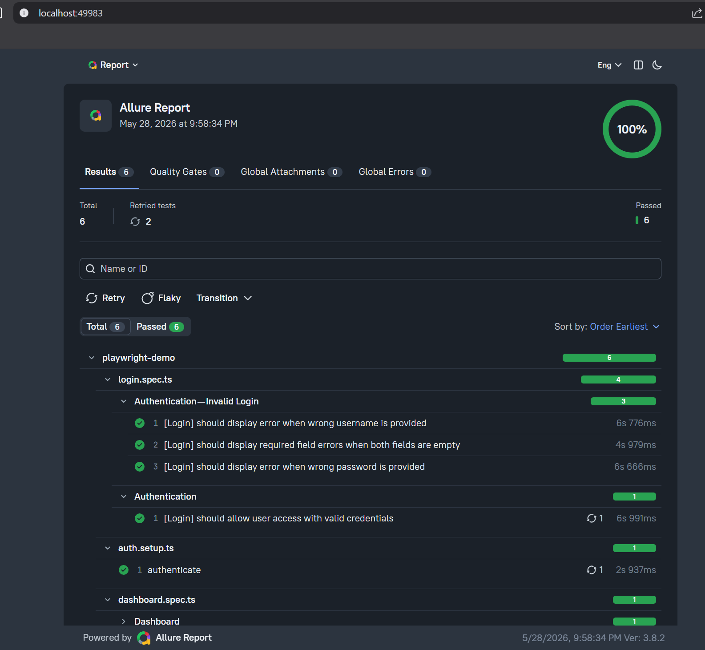
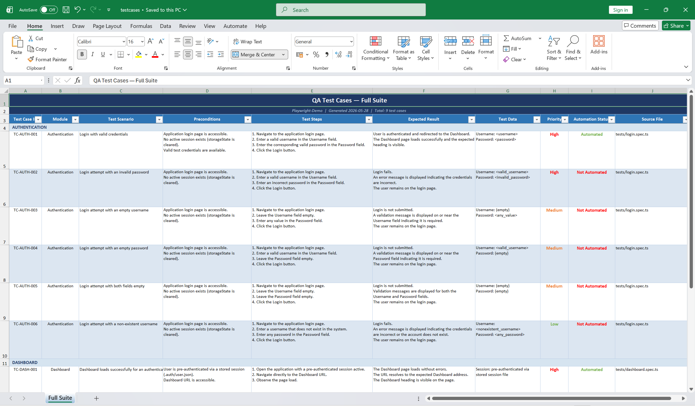

<div align="center">

# 🎭 OrangeHRM Test Automation

### A production-ready Playwright + TypeScript framework demonstrating POM, session reuse, Allure 3 reporting, and AI-assisted QA

[](https://playwright.dev)
[](https://www.typescriptlang.org)
[](https://nodejs.org)
[](https://allurereport.org)
[](#)

</div>

---

End-to-end automation for [OrangeHRM](https://opensource-demo.orangehrmlive.com) — an open-source HR management system — built as a reference implementation showcasing real-world Playwright patterns: **Page Object Model**, **session reuse via `storageState`**, **Winston logging**, **Allure 3 reporting**, and **Claude Code AI agents** for test generation and QA documentation.

---

## Features

- **Page Object Model** — one class per page, locators and actions cleanly separated
- **Session reuse** — logs in once, saves `storageState`, all tests start pre-authenticated
- **Structured logging** — Winston writes timestamped logs to `logs/` for every run
- **Allure 3 reporting** — rich visual test reports with steps, attachments, and history
- **AI agents** — Claude Code agents for test generation and QA documentation
- **Environment isolation** — all credentials and URLs managed via `.env`, never hardcoded

---

## Stack

| Tool | Version | Purpose |
|---|---|---|
| [Playwright](https://playwright.dev) | 1.60+ | Browser automation and test runner |
| TypeScript | 5.x | Type-safe test code |
| Winston | 3.x | Structured logging to file and console |
| dotenv | 17.x | Environment variable management |
| Allure Report | 3.x | Visual test reporting (`allure-playwright` + `allure` CLI) |

---

## Project Structure

```
Playwright-Demo/
├── .auth/                  # Saved auth state — generated at runtime (gitignored)
├── configs/
│   ├── env.ts              # Typed config object — wraps .env values
│   ├── global-setup.ts     # Runs once before all tests — logs SUITE START
│   └── global-teardown.ts  # Runs once after all tests — logs SUITE END
├── fixtures/
│   └── index.ts            # Extended test — injects page objects + afterEach logger
├── pages/
│   ├── login.page.ts       # LoginPage — locators + actions
│   └── dashboard.page.ts   # DashboardPage — locators + actions + verify
├── tests/
│   ├── auth.setup.ts       # Logs in once and saves storageState
│   ├── login.spec.ts       # Tests the login UI flow
│   └── dashboard.spec.ts   # Tests the dashboard using saved auth state
├── utils/
│   └── logger.ts           # Winston logger (console + file output)
├── logs/                   # Runtime logs — gitignored
├── allure-results/         # Raw Allure test data — gitignored
├── allure-report/          # Generated Allure HTML report — gitignored
├── qa-docs/                # Generated QA artifacts (manual test case docs)
├── .claude/                # Claude Code agent definitions and memory
├── .env                    # Credentials — never committed
└── playwright.config.ts    # Playwright configuration
```

---

## Prerequisites

- [Node.js](https://nodejs.org) 18 or higher
- [Java](https://www.java.com) (required by the Allure CLI)

---

## Quick Start

**1. Install dependencies**
```bash
npm install
```

**2. Install Playwright browsers**
```bash
npx playwright install
```

**3. Create your `.env` file**

Copy `.env.example` and fill in your credentials:
```
BASE_URL=https://opensource-demo.orangehrmlive.com
LOGIN_USERNAME=<username>
LOGIN_PASSWORD=<password>
```

**4. Run the tests**
```bash
npm test
```

**5. View the Allure report**
```bash
npm run allure:serve
```

---

## Running Tests

### Test execution

| Command | Description |
|---|---|
| `npm test` | Run the full test suite |
| `npm run test:ui` | Launch Playwright UI mode |
| `npx playwright test --project=chromium` | Run chromium project only |
| `npx playwright test tests/login.spec.ts` | Run login spec only |
| `npx playwright test tests/dashboard.spec.ts` | Run dashboard spec only |

### Reports

| Command | Description |
|---|---|
| `npx playwright show-report` | Open the built-in Playwright HTML report |
| `npm run allure:serve` | Generate and open Allure report in browser |
| `npm run allure:generate` | Generate Allure report to `allure-report/` |
| `npm run allure:open` | Open a previously generated Allure report |
| `npm run allure:clean` | Wipe `allure-results/` and `allure-report/` |

### Utilities

| Command | Description |
|---|---|
| `npm run auth:refresh` | Force a fresh login and regenerate `.auth/user.json` |
| `npm run logs:clear` | Clear all files in `logs/` |

---

## Test Coverage

| Spec | Suite | Test Case |
|---|---|---|
| `login.spec.ts` | Authentication | `[Login] should allow user access with valid credentials` |
| `login.spec.ts` | Authentication — Invalid Login | `[Login] should display error when wrong password is provided` |
| `login.spec.ts` | Authentication — Invalid Login | `[Login] should display error when wrong username is provided` |
| `login.spec.ts` | Authentication — Invalid Login | `[Login] should display required field errors when both fields are empty` |
| `dashboard.spec.ts` | Dashboard | `[Dashboard] should load for authenticated user` |

---

## Auth State

All tests in the `chromium` project start **pre-authenticated** using a saved browser session.

**How it works:**
1. The `setup` project runs `auth.setup.ts` once before any test
2. It logs in and saves the session to `.auth/user.json`
3. If `.auth/user.json` already exists and is valid, login is skipped
4. All `chromium` tests load that saved state automatically

**Force a fresh login:**
```bash
npm run auth:refresh
```

> Tests that verify the login UI (e.g. `login.spec.ts`) explicitly clear the inherited session with `test.use({ storageState: { cookies: [], origins: [] } })`.

---

## Allure Report



Allure results are written to `allure-results/` automatically on every test run.

**Standard workflow:**
```bash
npm test
npm run allure:serve
```

**Viewing a selective run (IDE extension):**
```bash
npm run allure:clean   # clear stale results first
# run your test via the IDE extension
npm run allure:serve
```

> The VS Code Playwright extension does not trigger `globalSetup`, so `allure-results/` accumulates across IDE runs. Run `allure:clean` before any selective run to ensure the report reflects only what you just executed.

---

## Logs

Logs are written to `logs/` during every test run (gitignored).

| File | Content |
|---|---|
| `logs/info.log` | Info-level messages |
| `logs/error.log` | Error-level and above |
| `logs/test.log` | All levels — full execution trace |

```bash
npm run logs:clear    # wipe all log files
```

---

## Claude Code Agents

This project ships with two built-in [Claude Code](https://claude.ai/code) agents that understand the framework conventions and can assist directly in your workflow.

### 🤖 `qa-sentinel`

Playwright automation engineer. Write, review, debug, and refactor automation code — enforces POM conventions, locator strategy, and import rules.

```
@agent-qa-sentinel review my new page object
@agent-qa-sentinel why is this test flaky?
@agent-qa-sentinel write a test for the profile page
```

### 📜 `qa-scribe`

QA documentation engineer. Converts automation tests into a structured Excel manual test case file.

```
@agent-qa-scribe generate regression
@agent-qa-scribe generate smoke
@agent-qa-scribe generate from tests/login.spec.ts
```

Output is written to `qa-docs/<type>-testcases.xlsx`. Versioned automatically (`-v2`, `-v3`) if the file already exists.

Agent definitions live in `.claude/agents/`. Memory is stored in `.claude/agent-memory/`.

---

## QA Docs



The `qa-docs/` folder holds generated manual test case artifacts produced by `qa-scribe`.

Files are named by suite type — e.g. `qa-docs/regression-testcases.xlsx` — and versioned automatically (`-v2`, `-v3`) if a file already exists.
